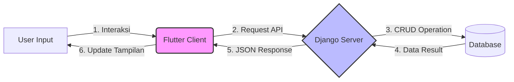

## 🏟️ LapaNG Mobile

---
Temukan lapangan, temukan teman ✨

**Tautan APK**     : [BitRise Download](https://app.bitrise.io/app/ce7ab9cc-8f02-4e4f-a136-36f213cbc227/installable-artifacts/64d842015f8d5196/public-install-page/bc1ec282523a680c399141536cc5a1e9)
**Video Promosi**  :

⚽️ Anggota Kelompok - D02

1. Abdurrahman Ammar Abqary (2406495994)  
2. Andrew Sanjay Hasian Panjaitan (2406403482)  
3. Levina Aurellia (2406356776)  
4. Muhammad Hafizh (2406437451)  
5. Nazwa Zahra Sausan (2406397750)  
6. Pria Abhirama Dewa (2406358043)  

---

🏀 Deskripsi

**LapaNG** adalah sebuah platform yang dikembangkan untuk memudahkan masyarakat kota **Jakarta** dalam menemukan dan mengakses lapangan atau ruangan olahraga dengan cara yang praktis dan efisien. Di tengah meningkatnya minat masyarakat terhadap olahraga dan aktivitas komunitas, seringkali sulit menemukan informasi lengkap mengenai fasilitas olahraga, kapasitas lapangan, kontak pemilik, dan update kegiatan yang sedang berlangsung.  

LapaNG hadir sebagai solusi digital yang menghubungkan pengguna dengan pemilik lapangan, sekaligus menjadi pusat informasi olahraga yang lengkap dan mudah diakses.  

Dengan LapaNG, pengguna tidak hanya dapat melihat daftar lapangan olahraga, tetapi juga tetap mendapatkan update tentang kegiatan dan event melalui fitur **Feeds**. Fitur ini menampilkan informasi terkini mengenai pertandingan, event komunitas, dan aktivitas olahraga di berbagai lokasi. Selain itu, aplikasi ini menyediakan informasi penyewaan perlengkapan olahraga, sehingga pengalaman berolahraga menjadi lebih lengkap.  

Semua transaksi, seperti peminjaman lapangan atau penyewaan equipment, dilakukan langsung antara pengguna dan pemilik lapangan, sehingga LapaNG tetap berfokus sebagai platform informasi.  

**Manfaat utama dari LapaNG antara lain:**  

1. **Akses Informasi Lengkap**  
   Pengguna dapat menemukan semua informasi tentang lapangan olahraga, kapasitas, fasilitas, dan kontak pemilik di satu tempat tanpa harus mencari di banyak sumber.  

2. **Terhubung dengan Komunitas**  
   Melalui feeds dan update kegiatan, pengguna dapat tetap mengikuti event, pertandingan, atau komunitas olahraga favorit mereka.  

3. **Mendukung Pemilik Lapangan**  
   Owner dapat mempromosikan fasilitas mereka, membagikan informasi kegiatan, dan menawarkan penyewaan equipment dengan mudah.  

4. **Praktis dan Efisien**  
   Semua informasi tersedia secara digital, sehingga pengguna dapat merencanakan aktivitas olahraga dengan cepat dan nyaman.  

---

🏸 Daftar Modul

### 👤 User–Owner  
Dikerjakan oleh **Abdurrahman Ammar Abqary**  
Fitur User–Owner menjadi pintu utama untuk mengakses seluruh layanan di lapa-NG. Melalui fitur ini, pengguna dapat membuat akun, login, dan logout dengan mudah.  

---

### 🏟️ Venue (Lapangan)  
Dikerjakan oleh  **Andrew Sanjay Hasian Panjaitan**       
Fitur Venue memungkinkan untuk menemukan berbagai lapangan di sekitar dengan mudah. Mulai dari futsal, basket, hingga badminton. Setiap lapangan dilengkapi dengan informasi lokasi, fasilitas, harga, serta foto-foto yang membantu memilih tempat terbaik untuk bermain.  

---

### 📅 Bookings  
Dikerjakan oleh  **Pria Abhirama Dewa**    
Fitur Bookings membantu pengguna memesan lapangan favorit dengan cepat dan praktis. Fitur ini memungkinkan pengguna melihat jadwal ketersediaan lapangan, serta memilih **jam mulai dan jam berakhir penyewaan** sesuai kebutuhan.  

---

### 📰 Feeds  
Dikerjakan oleh **Muhammad Hafizh**  
Fitur Feeds jadi tempat para user berbagi momen seru, tips olahraga, atau sekadar update kegiatan komunitas. Pengguna dapat berinteraksi dan membangun koneksi dengan pemain lain. Dengan Feeds, LapaNG bukan sekadar tempat booking, tapi juga wadah berkembangnya komunitas olahraga yang aktif dan seru.  

---

### ⭐ Review Lapangan  
Dikerjakan oleh **Levina Aurellia**  
Fitur untuk memberikan ulasan dan rating untuk lapangan yang telah digunakan. Fitur ini membantu pengguna lain mengetahui kualitas tempat, pelayanan, dan pengalaman bermain dari sudut pandang sesama pemain. Semakin banyak review, semakin mudah menemukan lapangan terbaik.  

---

### 🏋️ Equipment  
Dikerjakan oleh **Nazwa Zahra Sausan**  
Fitur Equipment memudahkan para owner untuk menawarkan berbagai perlengkapan olahraga yang bisa disewa oleh pengguna seperti bola, raket, dan perlengkapan latihan lainnya. Semua daftar perlengkapan dilengkapi dengan harga sewa dan deskripsi agar pengguna bisa memilih sesuai kebutuhan.  

---

🏃‍♂️🏃‍♀️ Jenis Pengguna (Role)

Aplikasi **LapaNG** memiliki dua jenis pengguna utama: **Owner** dan **User Biasa**.  

### 1. Owner 🏢  
Owner adalah penyedia lapangan atau ruangan olahraga.  
Tugas dan hak mereka antara lain:  
- Menambahkan informasi lapangan yang mereka miliki, termasuk fasilitas, kapasitas, dan kontak.  
- Mengupdate aktivitas di lapangan, seperti pertandingan atau event.  
- Menyewakan perlengkapan olahraga kepada pengguna.  

### 2. User Biasa 🏃‍♂️  
User biasa adalah pengguna aplikasi yang mencari dan memanfaatkan fasilitas olahraga.  
Fitur yang dapat digunakan oleh user biasa antara lain:  
- Melakukan pemesanan lapangan melalui fitur **Bookings**.  
- Memberikan **Review** terhadap lapangan yang telah digunakan.  
- Melihat dan menyewa **Equipment** yang tersedia.  

---

💻📲 Alur Pengintegrasian dengan Web Service

Aplikasi **LapaNG Mobile** terhubung dengan **LapaNG Web** (Django) menggunakan arsitektur Client-Server dan pertukaran data melalui **REST API**. Berikut adalah tahapan pengintegrasiannya:

1.  **Request dari Client (Flutter)** Pengguna melakukan interaksi di aplikasi mobile (seperti menekan tombol "Booking" atau membuka halaman "Review"). Aplikasi Flutter akan mengirimkan **HTTP Request** (GET atau POST) ke server Django menggunakan package seperti pbp_django_auth atau `http`.

2.  **Routing & Processing di Server (Django)** Request yang masuk akan diterima oleh urls.py di proyek Django, yang kemudian mengarahkan request tersebut ke fungsi view yang sesuai di views.py (misalnya pada modul `booking`, `reviews`, atau `authentication`).

3.  **Interaksi Database & Logika Bisnis** Fungsi view akan memproses logika bisnis (seperti memvalidasi data booking atau mengambil daftar lapangan). Jika diperlukan, Django akan berinteraksi dengan database (Models) untuk melakukan Create, Read, Update, atau Delete (CRUD) data.

4.  **Serialisasi Data (JSON Response)** Data yang diambil dari database atau hasil pemrosesan akan dikonversi (diserialisasi) menjadi format **JSON** (JavaScript Object Notation). Server kemudian mengirimkan **HTTP Response** berisi data JSON tersebut kembali ke aplikasi mobile.

5.  **Decoding & Display di Client (Flutter)** Aplikasi Flutter menerima respon JSON, lalu melakukan decoding untuk mengubah data tersebut menjadi objek Dart (Model). Data yang sudah diolah kemudian digunakan untuk memperbarui tampilan antarmuka (UI) agar pengguna dapat melihat informasi terbaru.

---

## 🎨 Link Figma
🔗 [Figma Design LapaNG](https://www.figma.com/design/W7PJXTejra9TNwidwSYNdd/PBP-TK-PTS?node-id=0-1&t=5S1UY1CwdeJr32kR-1)